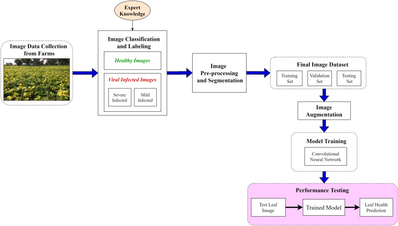
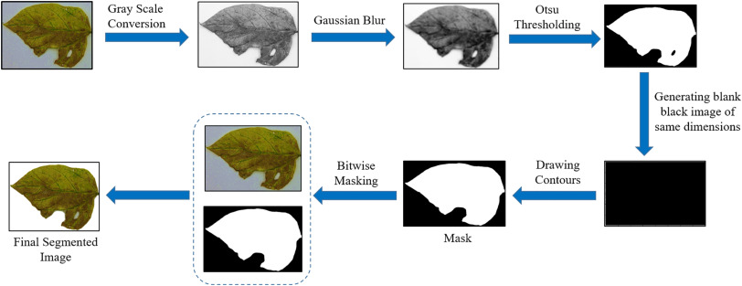
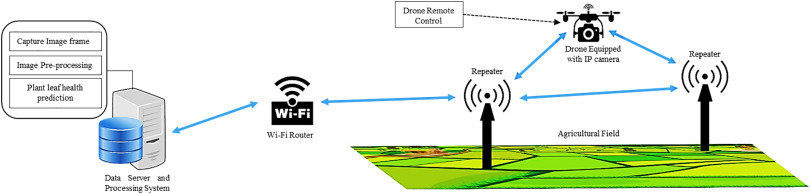

# Detection-of-Vigna-Mungo-Virus using deep CNN Network

## Description
This work proposes an automatic deep-learning-based viral infection detection method for a leguminous plant, Vigna mungo which is grown largely in the Indian subcontinent. Due to viral infection, some properties of the leaf image changes but the pattern is very random throughout the leaf structure. Hence, it is quite challenging to make an automatic disease detection method and perform the detection tasks in real-time. The collected image dataset of Vigna mungo leaves belonging to different categories are segmented and augmented to introduce more variety in the leaf image dataset.

## Workflow

## CNN diagram

## Segmentation flow chart

## Monitoring System.jpg

## Citation

If you use [Vigna Mungo Virus Analysis](https://github.com/manojkaushik/Detection-of-Vigna-Mungo-Virus) code in your research, we would appreciate a citation to both the original paper:

"*Joshi, Rakesh Chandra, et al. "VirLeafNet: Automatic analysis and viral disease diagnosis using deep-learning in Vigna mungo plant." Ecological Informatics 61 (2021): 101197.*"

"*Joshi, R. C., Kaushik, M., Dutta, M. K., Srivastava, A., & Choudhary, N. (2021). VirLeafNet: Automatic analysis and viral disease diagnosis using deep-learning in Vigna mungo plant. Ecological Informatics, 61, 101197.*"

"*Joshi, Rakesh Chandra, Manoj Kaushik, Malay Kishore Dutta, Ashish Srivastava, and Nandlal Choudhary. "VirLeafNet: Automatic analysis and viral disease diagnosis using deep-learning in Vigna mungo plant." Ecological Informatics 61 (2021): 101197.*"

"*Joshi, R.C., Kaushik, M., Dutta, M.K., Srivastava, A. and Choudhary, N., 2021. VirLeafNet: Automatic analysis and viral disease diagnosis using deep-learning in Vigna mungo plant. Ecological Informatics, 61, p.101197.*"

"*Joshi RC, Kaushik M, Dutta MK, Srivastava A, Choudhary N. VirLeafNet: Automatic analysis and viral disease diagnosis using deep-learning in Vigna mungo plant. Ecological Informatics. 2021 Mar 1;61:101197.*"